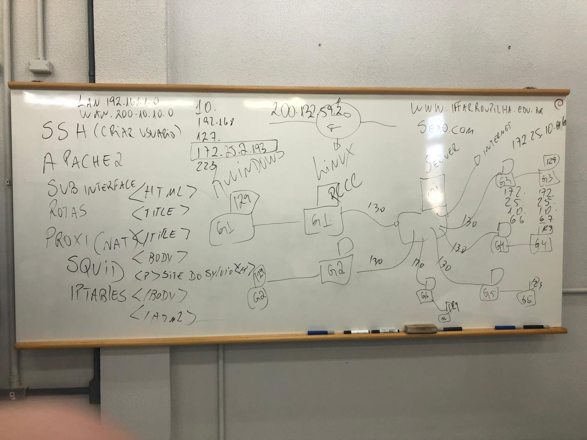

# Bloquear o Acesso de um PC Windows ao site www.iffarroupilha.edu.br e a Conteúdo Adulto Usando Linux

## Grupo 4: Romeo, Gilberto e Iago


<p align="center">
    
</p>

<p align="center">
    
</p>

---

| Nome           | Funcionalidade                                                |
|----------------|:-------------------------------------------------------------:|
| [SSH](#instalar-o-ssh-no-linux) | Acesso remoto e seguro ao servidor                  |
| [APACHE 2](#instalar-o-apache2-no-linux) | Servidor web para hospedar páginas e serviços web |
| [SUB-INTERFACE](#criar-sub-interfaces-no-linux) | Segmentação de rede para diferentes serviços de comunicação |
| [ROTAS]()     | Gerenciamento e direcionamento de tráfego entre diferentes redes |
| [PROXY](#bloquear-sites-com-proxy) | Intermediário para requisições externas e controle de acesso |
| [SQUID](#configurações-do-squid) | Servidor proxy para filtragem e bloqueio de sites e conteúdos |
| [IP TABLES](#ip-tables-no-linux) | Gerenciamento de regras de firewall para controle de tráfego na rede |


### Instalar o SSH no Linux

```bash
sudo apt-get update
sudo apt-get upgrade
sudo apt-get install openssh-client
````
### Criar um Usuário no Linux
```bash
sudo adduser robertovargas
````
### Adicionar o Usuário à Lista do SUDO
```bash
sudo usermod -aG sudo robertovargas
````
### Entrar como Super Usuário
```bash
sudo su
````
### Logar como o Novo Usuário
```bash
sudo su robertovargas
````
### Instalar o Apache2 no Linux
```bash
sudo apt update
sudo apt install apache2
````
### Iniciar o Serviço Apache
```bash
sudo systemctl start apache2
````
### Criar a Página de Redirecionamento
```bash
sudo nano /var/www/html/grupo4.html
````
```bash
<!DOCTYPE html>
<html lang="pt-br">
<head>
    <meta charset="UTF-8">
    <meta name="viewport" content="width=device-width, initial-scale=1.0">
    <title>ERRO!</title>
    <style>
        body {
            margin: 0;
            padding: 0;
            display: flex;
            justify-content: center;
            align-items: center;
            height: 100vh;
            background-color: #f5f5f5;
            font-family: Arial, sans-serif;
        }

        .erro {
            text-align: center;
        }

        h1 {
            font-size: 2.5rem;
            color: #ed4213;
        }

        h2 {
            color: #333;
            font-size: 1.3rem;
        }

        p {
            font-size: 1.2rem;
            color: #777;
            margin-top: 10px;
        }

        a {
            display: inline-block;
            margin-top: 20px;
            padding: 10px 20px;
            background-color: #333;
            color: #fff;
            text-decoration: none;
            border-radius: 5px;
            transition: background-color 0.3s;
        }

        a:hover {
            background-color: #555;
        }
    </style>
</head>
<body>
    <div class="erro">
        <h1>Não foi possível conectar!</h1>
        <h2>Acesso bloqueado pelo grandioso Grupo 4.</h2>
    </div>
</body>
</html>

````
### Configurar o Redirecionamento de Sites
```bash
sudo nano /etc/hosts
127.0.0.1 www.iffarroupilha.edu.br
127.0.0.1 sexo
sudo systemctl restart apache2

````
### Configurando Permissões
```bash
sudo chown -R www-data:www-data /var/www/html/
sudo chmod -R 755 /var/www/html/
````
### Habilitar no Firewall
```bash
sudo ufw allow 'Apache'
````
### Abrir o Site Criado:
```bash
http://172.25.2.204/grupo4.html
````
## IP TABLES no Linux
### Instalação
```bash
sudo apt install iptables
sudo apt install iptables-persistent
sudo systemctl enable netfilter-persistent
````
## Criar Sub-interfaces no Linux
### Instalar o net-tools
```bash
sudo apt install net-tools
````
### Mostrar Roteador
```bash
sudo ifconfig
````
### Adicionar Sub-interface
```bash
 sudo ifconfig enp0s31f6:0 192.168.1.33 netmask 255.255.255.252
````
## Bloquear Sites com Proxy
### Baixar o SQUID
```bash
 sudo apt-get install squid
````
### Verificar a Instalação
```bash
 sudo service squid status
````
### Configurar o SQUID
```bash
 cd /etc/squid
````
### Fazer Backup do SQUID
```bash
sudo cp squid.conf squid.conf.backup
````
### Apagar o SQUID e Criar Novo
```bash
sudo rm squid.conf
sudo nano squid.conf
````
### Entrar no Config
```bash
cd /etc/squid
````
### Criar Arquivos
```bash
sudo touch /etc/squid/sites_proibidos.txt
sudo touch /etc/squid/palavras_proibidas.txt
````
### Editar Arquivos
```bash
sudo nano /etc/squid/sites_proibidos.txt
sudo nano /etc/squid/palavras_proibidas.txt
````
### Configurações do SQUID
```bash
# Define a porta do proxy
http_port 3128

# Permite acesso apenas à rede local (192.168.1.8/255.255.255.248)
acl sites_proibidos url_regex -i "/etc/squid/sites_proibidos.txt"
http_access deny sites_proibidos

# Bloqueia acesso a sites listados no arquivo "sites_proibidos"
deny_info http://172.25.2.214/grupo4 sites_proibidos
````
### Reiniciar SQUID
```bash
sudo systemctl stop squid
sudo systemctl start squid
````

## Acessando o Site pelo Windows 11
- **Abra as configurações.**
- **Entre em Rede e Internet.**
- **Clique em Proxy.**
- **Desmarque a opção Detectar configurações automaticamente.**
- **Em Configurações de proxy manual, clique na opção Editar.**
- **Clique em Ativado.**
- **Em Endereço de proxy, coloque o IP da sua máquina Linux e, na Porta, coloque 3128.**


